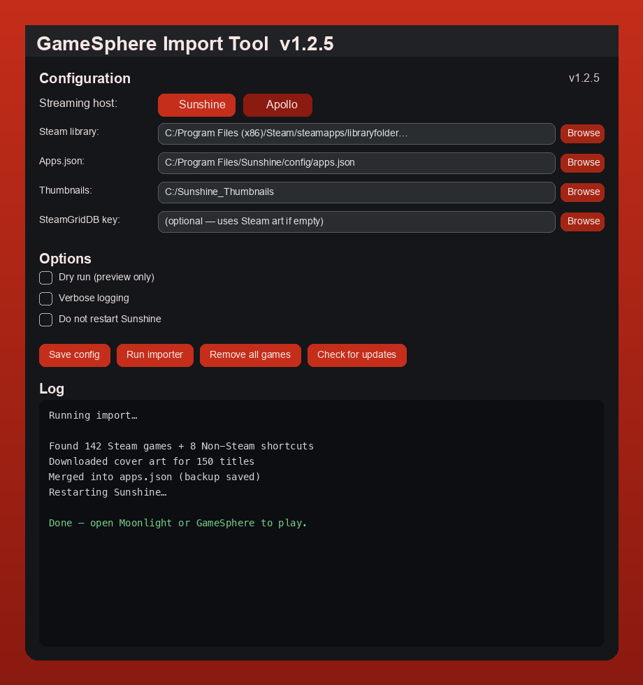

# GameSphere Import Tool

**Populate any Moonlight-compatible host with your game libraries — automatically.**

The GameSphere Import Tool reads installed games from Steam and (on Windows) Epic, GOG, Ubisoft Connect, Battle.net, EA App, and Xbox / Game Pass, downloads box art, writes the host `apps.json`, and restarts the streaming service. On Linux it is designed to be **automagic**: paths, launch commands, and service restart are detected for you.

Built for [GameSphere](https://github.com/trevlars/GameSphere) (Moonlight clients on iPhone, iPad, and Apple TV) — and **any Moonlight client** talking to **any Moonlight host**.



> Fork of **[Sunshine-App-Automation](https://github.com/CommonMugger/Sunshine-App-Automation)** by [CommonMugger](https://github.com/CommonMugger). We added multi-host support, a Windows GUI, Linux/Bazzite automagic, host-side streaming QOL (adapted from [StreamTweak](https://github.com/FoggyBytes/StreamTweak)), and GameSphere branding.

---

## Works with every Moonlight host

This tool is **host-agnostic**. It writes standard Sunshine-style `apps.json`, uses normal prep-cmd hooks, and optionally exposes a **TCP bridge on port 47998** so clients can tune link speed, read session grades, and query store badges — the same contract [StreamTweak](https://github.com/FoggyBytes/StreamTweak) pioneered for Windows.

| Host | Status | Notes |
|------|--------|-------|
| [**Sunshine**](https://github.com/LizardByte/Sunshine) | ✅ First-class | Native + Flatpak paths; systemd restart |
| [**Apollo**](https://github.com/ClassicOldSong/Apollo) | ✅ First-class | Set `HOST=apollo`; Virtual Display preserved on reset |
| [**Vibeshine**](https://github.com/ClassicOldSong/Apollo) / [**Vibepollo**](https://github.com/ClassicOldSong/Apollo) | ✅ Auto-detected | `~/.config/vibeshine` / `vibepollo` paths |
| **Your fork** | ✅ Welcome | Point `sunshine_apps_json_path` at your config; PR path detection |

**Moonlight clients** (GameSphere, official Moonlight, community clients) do not need changes to benefit from library sync. Clients that implement the bridge verbs get link-speed match, session telemetry, and store badges on top.

### What you get on any host

1. **Library sync** — Steam + Non-Steam shortcuts + (Windows) multi-store discovery with correct launch commands and cover art  
2. **Merge, don’t wipe** — Desktop, Big Picture, custom prep-cmd, and hand-edited entries stay put  
3. **Quit App that works** — prep-cmd undo closes detached Steam / emu launches on Linux and Windows  
4. **Host tuning** *(optional)* — link speed, HDR/spatial-audio prep, NVIDIA snapshots, managed apps, tile swap  
5. **Bridge** *(optional)* — `NETINFO`, `SETSPEED`, `SESSIONDATA`, `APPSTORES`, `GAMESTATE`, `LOCKSTATE`, …

### Integrate into your host or client

Pick the depth that fits your project:

| Goal | Start here |
|------|------------|
| **“Sync library” button** in Sunshine / Apollo / fork web UI | [HOST_INTEGRATION.md § Web UI button](docs/HOST_INTEGRATION.md#1-web-ui-button--sync-steam-library-recommended) |
| **First-run wizard** after pairing | [HOST_INTEGRATION.md § Setup wizard](docs/HOST_INTEGRATION.md#2-first-run--setup-wizard) |
| **Scheduled sync** (Steam installs while host runs) | [systemd timer example](docs/HOST_INTEGRATION.md#3-scheduled-sync-set-and-forget) |
| **Non-Steam shortcuts** (Eden, Ryujinx, emulators) | [Shortcuts & custom games](docs/HOST_INTEGRATION.md#non-steam-shortcuts--custom-games) |
| **Embed host tuning + bridge** in your stack | [Host tuning & bridge](docs/HOST_INTEGRATION.md#host-tuning--tcp-bridge-optional) |
| **Client bridge wire protocol** (Moonlight / GameSphere / your app) | [CLIENT_BRIDGE.md](docs/CLIENT_BRIDGE.md) |
| **StreamTweak feature parity** checklist | [STREAMTWEAK_PARITY.md](docs/STREAMTWEAK_PARITY.md) |

**Maintainers:** we want this in every streaming repo — Sunshine, Apollo, Vibeshine, GameSphere, Decky plugins, distro images. Open a PR to add your config paths to `platform_paths.py`, or document your layout in [HOST_INTEGRATION.md](docs/HOST_INTEGRATION.md).

```bash
# Drop-in subprocess contract (same on all hosts)
gamesphere-import --print-config   # show detected paths as JSON
gamesphere-import --dry-run        # preview
gamesphere-import                  # import + restart host
```

---

## Quick start

> **Easiest path:** [Download the latest release](https://github.com/trevlars/Gamesphere-Import-Tool/releases/latest) — Flatpak, AppImage, or Windows `.exe`. No git required.

### Linux — Flatpak (recommended on Bazzite / Steam Deck)

Install the Freedesktop runtime once if Flatpak asks:

```bash
flatpak install flathub org.freedesktop.Platform//24.08
```

**One-step install** (`.flatpakref` from Releases):

```bash
curl -fsSL https://github.com/trevlars/Gamesphere-Import-Tool/releases/latest/download/GameSphere-Import-Tool.flatpakref \
  -o GameSphere-Import-Tool.flatpakref
flatpak install --user -y GameSphere-Import-Tool.flatpakref
flatpak run io.github.trevlars.GamesphereImportTool --dry-run
flatpak run io.github.trevlars.GamesphereImportTool
```

After install, `gamesphere-import` is usually on your PATH via Flatpak exports (`~/.local/share/flatpak/exports/bin`).

### Linux — AppImage (portable, no install)

```bash
curl -fsSL https://github.com/trevlars/Gamesphere-Import-Tool/releases/latest/download/GameSphere-Import-Tool-x86_64.AppImage -O
chmod +x GameSphere-Import-Tool-x86_64.AppImage
./GameSphere-Import-Tool-x86_64.AppImage --dry-run
./GameSphere-Import-Tool-x86_64.AppImage
```

Move to `~/.local/bin` if you want it always available.

### Linux — shell installer (Decky / host bridge / power users)

One command installs from source checkout, creates `gamesphere-import`, and can enable the optional TCP bridge systemd unit:

```bash
curl -fsSL https://github.com/trevlars/Gamesphere-Import-Tool/releases/latest/download/install-linux.sh | bash
gamesphere-import --dry-run   # preview (optional)
gamesphere-import             # import + restart Sunshine
```

Optional host bridge on boot:

```bash
GAMESPHERE_ENABLE_HOST_BRIDGE=1 curl -fsSL https://github.com/trevlars/Gamesphere-Import-Tool/releases/latest/download/install-linux.sh | bash
```

**No `.env` editing required** on typical setups. The tool finds native or Flatpak Steam, Sunshine/Apollo config, and uses `systemctl --user restart sunshine` when that service exists.

<details>
<summary>Install from main branch instead (bleeding edge)</summary>

```bash
curl -fsSL https://raw.githubusercontent.com/trevlars/Gamesphere-Import-Tool/main/scripts/install-linux.sh | bash
```

</details>

### Windows — GUI or `.exe`

1. Download **`GamesphereImportTool.exe`** from **[Releases → Latest](https://github.com/trevlars/Gamesphere-Import-Tool/releases/latest)** (Assets section).
2. Run as **Administrator** → choose **Sunshine** or **Apollo** → **Save config** → **Run importer**.

Or from source: `uv sync` then `uv run gui.py`.

### macOS — CLI

```bash
git clone https://github.com/trevlars/Gamesphere-Import-Tool.git && cd Gamesphere-Import-Tool
uv sync && uv run main.py --auto-config && uv run main.py
```

---

## What happens automatically

When you run the importer with no manual setup:

| Automagic step | Details |
|----------------|---------|
| **Path detection** | Steam `libraryfolders.vdf`, `userdata/*/config/shortcuts.vdf`, host `apps.json`, covers folder — native, Flatpak, or Windows Program Files |
| **Host profile** | Detects Bazzite, SteamOS, Windows, macOS |
| **Steam launch commands** | Windows: `steam://rungameid/…` · Linux: `detached` + `setsid steam …` (Sunshine requirement) · Flatpak when needed |
| **Quit App close** | Windows + Linux/macOS: prep-cmd undo closes the Steam game (`gamesphere-steam-close`) by AppID, install path, and exe name, then watches for late-spawned processes (Hogwarts Legacy–class long launches) |
| **Auto-update** | GUI checks GitHub Releases on launch; **Check for updates** downloads the Windows exe or refreshes Linux (Flatpak bundle, AppImage, or shell install). CLI: `--check-update` / `--apply-update` |
| **Stream prep hooks** | On Bazzite, adds `sunshine-stream-prep.sh` prep to imported games when that script exists |
| **Artwork** | Steam CDN thumbnails in parallel (optional [SteamGridDB](https://www.steamgriddb.com/profile/preferences/api) key) |
| **Merge, don’t wipe** | Keeps your Desktop, Steam Big Picture, and custom `prep-cmd` entries |
| **Prune** | Removes uninstalled Steam (and Epic / GOG / Ubisoft / Battle.net / EA / Xbox on Windows) games from the host list |
| **Backup** | Copies `apps.json` before writing |
| **Repair** | Re-import fixes Linux `cmd`→`detached` and adds missing Quit App close undos |
| **Start Steam** | Launches Steam if it isn’t running |
| **Restart host** | Windows exe · Linux systemd · Flatpak restart |

Inspect what would be detected without importing:

```bash
gamesphere-import --print-config
```

---

## Features

- **Steam** — installed library games **and** Non-Steam shortcuts (`shortcuts.vdf`: Eden, emulators, etc.) with concurrent name/art fetch
- **Multi-store Windows discovery** *(inspired by [StreamTweak](https://github.com/FoggyBytes/StreamTweak))* — Epic, GOG, Ubisoft Connect, Battle.net, EA App, and Xbox / Game Pass
- **Store-native cover art** — Epic `catcache.bin`, GOG Galaxy cache, Ubisoft CDN, Battle.net logos, plus Steam Store search fallback (600×900 portrait minimum)
- **Correct launch commands per store** — Epic launcher protocol (including edition triples), Xbox `shell:appsFolder`, direct exe for GOG/Ubisoft/EA
- **`.GamingRoot` scan** — finds Xbox/Game Pass installs on any drive, not only `C:\XboxGames`
- **Windows display-name fixup** — resolves internal codenames via Uninstall registry (StreamTweak pattern)
- **Windows extras** — custom JSON games, `.lnk` shortcuts
- **Sunshine & Apollo** — same tool; set `HOST=apollo` or use the Windows GUI host selector
- **Cross-platform CLI** — Windows, Linux, macOS (Steam-focused on Linux/macOS)
- **Windows GUI** — CustomTkinter app + standalone `.exe`
- **DeckyLoader** — optional Game Mode plugin ([`decky/README.md`](decky/README.md))

### Host tuning (StreamTweak-inspired)

Adapted from [StreamTweak](https://github.com/FoggyBytes/StreamTweak) host-side features — Windows full support, Linux/Bazzite best-effort where the stack allows it.

| Feature | Windows | Linux / Bazzite |
|---------|---------|-----------------|
| **Link-speed match** | PowerShell `Set-NetAdapterAdvancedProperty` | `ethtool` (read always; write may need root) |
| **HDR / spatial audio** | Auto HDR preference + spatial sound device selection | `wlr-randr` HDR, PipeWire default sink |
| **NVIDIA Sentinel** | Profile Inspector `.nip` if installed; else `nvidia-smi` snapshot | `nvidia-settings -q all` snapshot |
| **Session telemetry** | Tail Sunshine log → `sessions.json` + grades from client stats | Same |
| **TCP bridge** | Port **47998** — `NETINFO`, `SETSPEED`, `RESTORE`, `STATS`, `TAILSCALE`, `LASTSESSION`, `SESSIONDATA`, `APPSTORES`, `GAMESTATE`, `LOCKSTATE` | Same |
| **Tailscale presence** | CLI + interface scan | `tailscale ip -4` + `ip addr` |
| **Managed apps** | Kill on stream start, relaunch on end (Hue Sync, RGB tools, …) | Same |
| **Host tile swap** | Replace Sunshine `desktop.png` / `steam.png` (reversible backups) | Same paths under `~/.config/sunshine/assets` |

Config: `%LOCALAPPDATA%\GameSphere\host_tuning.json` (Windows) or `~/.config/gamesphere-import-tool/host_tuning.json` (Linux).

```bash
# One-time setup (Linux install-linux.sh runs init --enable-all)
uv run host_tuning_cli.py init --enable-all

# Apply tiles / detect log / NVIDIA snapshot
gamesphere-import --host-tuning-only
# or after a normal import:
gamesphere-import --host-tuning

# Stream prep hooks (also merged into every imported Steam app’s prep-cmd)
~/.local/bin/gamesphere-host-prep.sh start   # session start
~/.local/bin/gamesphere-host-prep.sh stop    # session end

# TCP bridge + session monitor (background)
gamesphere-import --host-bridge
# or: uv run host_tuning_cli.py bridge
# Linux auto-enable on install: GAMESPHERE_ENABLE_HOST_BRIDGE=1 bash install-linux.sh

# Session history
uv run host_tuning_cli.py sessions
uv run host_tuning_cli.py status
```

Managed apps example — add to `host_tuning.json`:

```json
"managed_apps": [
  { "name": "Hue Sync", "path": "C:\\Program Files\\Hue Sync\\HueSync.exe", "auto_manage": true }
]
```

---

## Command reference

```bash
gamesphere-import                 # import (alias after Linux install)
uv run main.py                    # same, from repo directory

uv run main.py --dry-run          # preview changes only
uv run main.py --verbose          # debug logging
uv run main.py --no-restart       # skip Steam start + host restart
uv run main.py --remove-games     # reset to stock apps only
uv run main.py --auto-config      # write .env from auto-detected paths
uv run main.py --print-config     # print detected paths as JSON
uv run main.py --version
uv run main.py --check-update     # compare to GitHub Releases
uv run main.py --apply-update     # install the newest release
uv run main.py --host-tuning      # import + apply host tuning
uv run main.py --host-tuning-only # host tuning only (no library sync)
uv run main.py --host-bridge      # TCP bridge on 47998 + session monitor
uv run host_tuning_cli.py status  # host tuning diagnostics
```

Log file: `sunshine_automation.log` in the working directory.

---

## Configuration (optional)

Auto-detection covers most users. Override with a `.env` file only when needed:

```bash
uv run main.py --auto-config   # generate a starting .env
```

See [`.env.example`](.env.example) for all keys. Common overrides:

| Variable | When to set |
|----------|-------------|
| `HOST` | `apollo` instead of default Sunshine |
| `STEAMGRIDDB_API_KEY` | Community cover art picks |
| `CUSTOM_GAMES_JSON_PATH` | Non-Steam executables (see `custom_games.example.json`) |
| `XBOX_GAMES_FOLDERS` | Windows Xbox installs outside `C:\XboxGames` |

### Path reference

| Platform | Steam VDF | apps.json | Covers |
|----------|-----------|-----------|--------|
| **Linux (native)** | `~/.local/share/Steam/steamapps/libraryfolders.vdf` | `~/.config/sunshine/apps.json` | `~/.config/sunshine/covers/` |
| **Linux (Flatpak)** | `~/.var/app/com.valvesoftware.Steam/.../libraryfolders.vdf` | `~/.var/app/dev.lizardbyte.app.Sunshine/.../apps.json` | under Flatpak config |
| **Windows** | `C:/Program Files (x86)/Steam/steamapps/libraryfolders.vdf` | `C:/Program Files/Sunshine/config/apps.json` | configurable |
| **macOS** | `~/Library/Application Support/Steam/steamapps/libraryfolders.vdf` | `~/.config/sunshine/apps.json` | `~/.config/sunshine/covers/` |

---

## DeckyLoader (Steam Deck / Bazzite Game Mode)

```bash
# After install-linux.sh
cd ~/.local/share/gamesphere-import-tool/decky
npm install && npm run build   # or build on dev machine, then sync repo
ln -sfn "$PWD" ~/homebrew/plugins/gamesphere-import
```

Reload Decky plugins from the quick-access menu. The plugin exposes import toggles (dry run, skip restart, host tuning), bridge service control, updates, and status — see [`decky/README.md`](decky/README.md).

---

## For host & client developers

Want a **“Sync Steam library”** button, first-run wizard, scheduled sync, Non-Steam shortcut import, or StreamTweak-style bridge in **Sunshine, Apollo, Vibeshine, GameSphere, or your fork**?

→ **[docs/HOST_INTEGRATION.md](docs/HOST_INTEGRATION.md)** — subprocess contract, shortcuts/custom games, host tuning, TCP bridge verbs, systemd timers, UI copy, Python hooks.

→ **[docs/STREAMTWEAK_PARITY.md](docs/STREAMTWEAK_PARITY.md)** — honest feature matrix vs [StreamTweak](https://github.com/FoggyBytes/StreamTweak).

We welcome PRs that add path detection for new hosts or client-side bridge support.

## Troubleshooting

| Issue | Fix |
|-------|-----|
| Game tile appears but **doesn’t launch** on Linux | Re-run import (v0.3.0+ uses `detached` commands). Check Sunshine log for `Executing [Game Name]`. |
| Game **launches** but **Exit on phone doesn’t close** it on the PC | Confirm Sunshine log shows `Executing Undo Cmd: …gamesphere-steam-close…`. v0.3.4+ also reaps slow-to-start titles (launcher / EAC / late shipping exe) via path+exe match and a background watch. Re-run import or `install-linux.sh` if the helper is old. |
| **Permission denied** writing `apps.json` (Windows Program Files) | Run GUI/exe as Administrator |
| **Missing games** in list | Some VDF entries are redistributables, not games — warnings are normal |
| **No box art** for one title | Steam CDN gap; optional SteamGridDB key |
| Paths wrong | `gamesphere-import --print-config` then edit `.env` or open an issue |

---

## Releases

| Version | Highlights |
|---------|------------|
| **v1.2.3** | Flatpak + AppImage on every release; `.flatpakref` one-step install; shell installer for Decky/bridge |
| **v1.2.2** | DeckyLoader plugin — import toggles, host tuning, bridge service control, updates; prebuilt `decky/dist` |
| **v1.2.1** | Bridge `APPSTORES` / `GAMESTATE` / `LOCKSTATE`; session detection 8.3.0-style fixes; host-agnostic integration docs + StreamTweak parity matrix |
| **v1.2.0** | Host tuning module — link speed, HDR/spatial audio, NVIDIA snapshots, session telemetry, TCP bridge (47998), Tailscale, managed apps, host tile swap (StreamTweak-inspired; Linux adapted) |
| **v1.1.0** | Multi-store Windows discovery + cover art (GOG, Ubisoft, Battle.net, EA), Epic launch triples, Xbox `.GamingRoot` + `shell:appsFolder` — patterns from [StreamTweak](https://github.com/FoggyBytes/StreamTweak) |
| **v1.0.2** | Late-start game close (Hogwarts) + in-app auto-update (Windows + Linux) |
| **v0.3.3** | Quit App actually stops Game Mode emu/Non-Steam titles (tree kill, 64-bit AppID) |
| **v0.3.1** | Quit App closes detached Steam games on Linux/macOS |
| **[v0.3.0](https://github.com/trevlars/Gamesphere-Import-Tool/releases/tag/v0.3.0)** | Linux automagic, Bazzite/Deck support, detached launch fix, Decky scaffold |
| [v1.0.1](https://github.com/trevlars/Gamesphere-Import-Tool/releases/tag/v1.0.1) | Windows Epic (beta) + Xbox discovery |

Full history: [CHANGELOG.md](CHANGELOG.md)

**Windows:** [Releases → Latest](https://github.com/trevlars/Gamesphere-Import-Tool/releases/latest) → download **`GamesphereImportTool.exe`** (or **Check for updates** in the GUI)  
**Linux:** `curl -fsSL …/releases/latest/download/install-linux.sh | bash` — or `gamesphere-import --apply-update` after the first install.

---

## Development

```bash
uv sync                  # install deps
uv run main.py --dry-run # test
uv sync --extra build && uv run build_exe.py   # Windows .exe only
```

Publishing a Windows release: push tag `vX.Y.Z`, draft/publish a GitHub Release — CI attaches the `.exe` ([`.github/workflows/build-release.yml`](.github/workflows/build-release.yml)).

---

## Acknowledgements

- [FoggyBytes/StreamTweak](https://github.com/FoggyBytes/StreamTweak) — multi-store discovery, store-native cover art, per-store launch patterns, and host-side streaming QOL (GPL-3.0; adapted with attribution)
- [CommonMugger/Sunshine-App-Automation](https://github.com/CommonMugger/Sunshine-App-Automation) — original automation
- [Sunshine](https://github.com/LizardByte/Sunshine) · [Apollo](https://github.com/ClassicOldSong/Apollo) · Vibeshine / Vibepollo — streaming hosts
- [GameSphere](https://github.com/trevlars/GameSphere) — client shelf
- [uv](https://github.com/astral-sh/uv)

---

## Legal disclaimer

<sub>*This project is provided for convenience only. You are responsible for your own setup.*</sub>

**Use at your own risk.** Provided **“as is”** without warranty. Not affiliated with Valve, LizardByte, Apollo, or SteamGridDB. Back up `apps.json` before first use.
