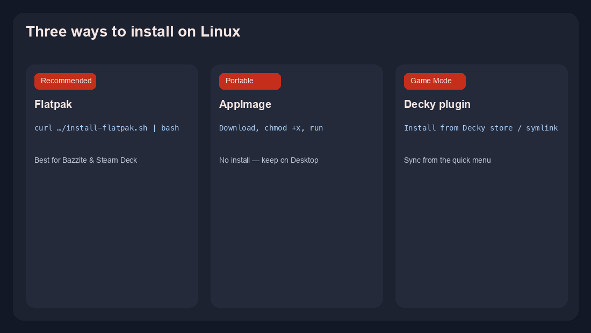

# GameSphere Import Tool

**Put your Steam library on Sunshine or Apollo — with cover art — so you can stream from Moonlight, GameSphere, or any Moonlight client.**

No manual `apps.json` editing. Run the tool once (or again after you buy new games) and your titles show up in the host app with artwork.

<p align="center">
  
  <br>
  <sub><b>Windows</b> — download the <code>.exe</code>, run as administrator, click <b>Run importer</b>.</sub>
</p>

<p align="center">
  <a href="https://github.com/trevlars/Gamesphere-Import-Tool/releases/latest"><strong>⬇ Download latest release</strong></a>
  &nbsp;·&nbsp;
  <a href="docs/USER-GUIDE.md">Full user guide</a>
  &nbsp;·&nbsp;
  <a href="CHANGELOG.md">What's new</a>
</p>

---

## What it does

1. **Finds your games** — Steam library + Non-Steam shortcuts (Eden, emulators, etc.). On Windows it also scans Epic, GOG, Ubisoft, Battle.net, EA, and Xbox / Game Pass.
2. **Builds your streaming list** — Writes Sunshine-style `apps.json`, downloads box art, keeps your Desktop / Big Picture entries.
3. **Restarts the host** — Sunshine or Apollo reloads so Moonlight sees everything right away.

Built for [GameSphere](https://github.com/trevlars/GameSphere) and works with **official Moonlight** and other Moonlight-compatible clients.

---

## Install (pick your platform)

### Windows — easiest if you use a gaming PC as the host

1. Open **[Releases → Latest](https://github.com/trevlars/Gamesphere-Import-Tool/releases/latest)** and download **`GamesphereImportTool.exe`**.
2. **Right-click → Run as administrator** (needed to write Sunshine/Apollo config under Program Files).
3. Choose **Sunshine** or **Apollo**, then click **Run importer**.

The app fills in paths automatically on a normal install. Use **Dry run** first if you want a preview without changing anything.

### Linux — Bazzite, Steam Deck (desktop), or any distro

<p align="center">
  
</p>

**Recommended — one command (Flatpak):**

```bash
curl -fsSL https://github.com/trevlars/Gamesphere-Import-Tool/releases/latest/download/install-flatpak.sh | bash
flatpak run io.github.trevlars.GamesphereImportTool
```

**Portable — AppImage (no install):**

```bash
curl -fsSL https://github.com/trevlars/Gamesphere-Import-Tool/releases/latest/download/GameSphere-Import-Tool-x86_64.AppImage -O
chmod +x GameSphere-Import-Tool-x86_64.AppImage
./GameSphere-Import-Tool-x86_64.AppImage
```

<details>
<summary><strong>Advanced Linux</strong> — shell installer, host bridge, Decky</summary>

Shell checkout + `gamesphere-import` command (Decky plugin, optional TCP bridge):

```bash
curl -fsSL https://github.com/trevlars/Gamesphere-Import-Tool/releases/latest/download/install-linux.sh | bash
```

Optional bridge for GameSphere session stats: prefix with `GAMESPHERE_ENABLE_HOST_BRIDGE=1`.

**Steam Deck Game Mode:** see the [Decky plugin guide](decky/README.md).

</details>

### macOS

Steam-only CLI from source — see [User guide → macOS](docs/USER-GUIDE.md#macos).

---

## After you install

| Step | What to do |
|------|------------|
| **First run** | Import once. Wait for “Done” / Sunshine restart. |
| **On your client** | Open Moonlight or GameSphere — your games should appear with art. |
| **New Steam games** | Run the tool again anytime you install something new. |
| **Preview only** | Turn on **Dry run** (Windows GUI) or add `--dry-run` on Linux. |

You usually **do not** need a `.env` file or path tweaks on Bazzite, Steam Deck, or a standard Windows Sunshine install.

**Updates** happen from [GitHub Releases](https://github.com/trevlars/Gamesphere-Import-Tool/releases/latest) — no git pull:

| Platform | How it stays current |
|----------|----------------------|
| **Windows** | The GUI checks on launch and via **Check for updates** (downloads the new `.exe`). |
| **Linux** (Bazzite / Deck / Flatpak / git install) | A systemd user timer runs daily (and shortly after boot). Re-run `install-linux.sh` / `install-flatpak.sh` once to enable it. |
| **macOS** | Source checkout: `uv run main.py --apply-update` (no `.app` is shipped). |

Opt out on Linux: `GAMESPHERE_AUTO_UPDATE=0`.

---

## Works with these streaming hosts

| Host | Supported |
|------|-----------|
| [Sunshine](https://github.com/LizardByte/Sunshine) | ✅ Native + Flatpak |
| [Apollo](https://github.com/ClassicOldSong/Apollo) | ✅ Choose Apollo in the Windows GUI or set `HOST=apollo` |
| Vibeshine / Vibepollo | ✅ Auto-detected paths |
| Your fork | ✅ Point `sunshine_apps_json_path` at your config |

Clients (GameSphere, Moonlight, etc.) do **not** need changes for library sync.

---

## Common questions

| Problem | Try this |
|---------|----------|
| **Games don’t show in Moonlight** | Run import again. On Windows, confirm you used **Run as administrator**. |
| **Game won’t launch from Moonlight (Linux)** | Re-run import — the tool fixes launch commands automatically. |
| **Exit on phone doesn’t close the game on PC** | Re-run import so the Quit App helper is installed (v1.0.2+). |
| **Permission denied on Windows** | Run the `.exe` as administrator. |
| **Missing cover for one game** | Normal for some titles; optional [SteamGridDB](https://www.steamgriddb.com) key in settings. |
| **Something else** | [User guide → Troubleshooting](docs/USER-GUIDE.md#troubleshooting) |

---

## Optional extras (power users)

These are **off by default** — most people can ignore them.

- **Host tuning** — link speed, HDR/audio prep, session grades ([StreamTweak](https://github.com/FoggyBytes/StreamTweak)-inspired). See [user guide](docs/USER-GUIDE.md#host-tuning-optional).
- **GameSphere bridge** — TCP port 47998 for link-speed match and session stats in GameSphere clients. See [CLIENT_BRIDGE.md](docs/CLIENT_BRIDGE.md).
- **Mic to PC** — one button / `--setup-mic`: Windows VB-CABLE + VBAN feeder (license prompt) or Linux PipeWire. Discord uses **CABLE Output**. See [MIC-TO-PC.md](docs/MIC-TO-PC.md).
- **DeckyLoader plugin** — sync from Steam Deck Game Mode. See [decky/README.md](decky/README.md).

---

## For developers & host maintainers

Embedding a “Sync library” button, scheduled sync, or bridge in Sunshine / Apollo / your fork:

→ **[docs/HOST_INTEGRATION.md](docs/HOST_INTEGRATION.md)** · **[docs/CLIENT_BRIDGE.md](docs/CLIENT_BRIDGE.md)** · **[docs/STREAMTWEAK_PARITY.md](docs/STREAMTWEAK_PARITY.md)**

CLI reference and all flags: **[docs/USER-GUIDE.md → Command reference](docs/USER-GUIDE.md#command-reference)**

---

## What's new

Latest: **v1.3.2** — unattended Linux updates from GitHub Releases + **v1.3.0** **Set up mic for GameSphere** (Windows VB-CABLE + VBAN feeder; Linux PipeWire). Discord/OBS use **CABLE Output**. Flatpak, AppImage, and Windows `.exe` on every [release](https://github.com/trevlars/Gamesphere-Import-Tool/releases/latest).

Full history: **[CHANGELOG.md](CHANGELOG.md)**

---

## Acknowledgements

Fork of [Sunshine-App-Automation](https://github.com/CommonMugger/Sunshine-App-Automation) by [CommonMugger](https://github.com/CommonMugger). Multi-store and host QOL patterns adapted from [StreamTweak](https://github.com/FoggyBytes/StreamTweak) (GPL-3.0).

---

## Legal

Use at your own risk. Not affiliated with Valve, LizardByte, or Apollo. The tool backs up `apps.json` before writing — keep that backup if you hand-edit the host config.
