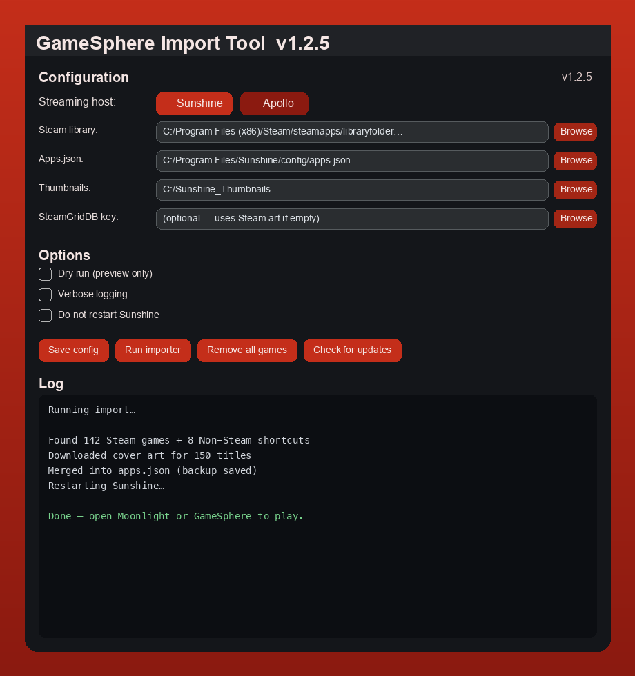

# GameSphere Companion Tool — Decky plugin

Sync your Steam library into Sunshine **from Steam Deck Game Mode** — no keyboard required.

<p align="center">
  
</p>

## Before you start

You need the Companion Tool installed on the host **once**. Pick either:

**Flatpak (easiest):**

```bash
curl -fsSL https://github.com/trevlars/GameSphere-Companion-Tool/releases/latest/download/install-flatpak.sh | bash
```

**Or shell install** (same as older docs — also enables the daily auto-update timer):

```bash
curl -fsSL https://github.com/trevlars/GameSphere-Companion-Tool/releases/latest/download/install-linux.sh | bash
```

Sunshine should be running: `systemctl --user status sunshine`

New Linux installs (and this plugin on first load) enable **`gamesphere-import-update.timer`** so later GitHub Releases apply without SSH. Opt out: `GAMESPHERE_AUTO_UPDATE=0`.

## Enable the plugin

Prebuilt UI is included — you usually **do not** need Node/npm on the Deck.

```bash
ln -sfn "$HOME/.local/share/gamesphere-import-tool/decky" \
  "$HOME/homebrew/plugins/gamesphere-companion"
# Remove the old symlink name if present:
rm -f "$HOME/homebrew/plugins/gamesphere-import"
```

On Bazzite, if `~/homebrew/plugins` is root-owned, use `sudo` for the symlink.

Then: **Quick Access → Decky → reload plugins** (or restart Plugin Loader).

<details>
<summary>Rebuild from source (developers only)</summary>

```bash
cd decky && npm install && npm run build
```

</details>

## Using the plugin

Open **Quick Access → GameSphere Companion Tool**.

| Section | What it does |
|---------|----------------|
| **Overview** | Version, bridge/mic glance, sync now, mic test |
| **Microphone** | Peak test, fullscreen Mic Test, AEC toggle, setup |
| **Library** | Auto-sync (~15 min); full import under “Show import options” |
| **Host** | Bridge, tuning, WAN glance, doctor |
| **Updates & maintenance** | Updates, refresh `.env`, remove all games |

### Sync toggles

| Toggle | Meaning |
|--------|---------|
| Dry run | Preview only — no files written |
| Skip Sunshine restart | Import without restarting the host |
| Apply host tuning | Extra streaming tweaks after import |
| Verbose | More detail in the log panel |

## Notes

- Linux import covers **Steam + Non-Steam shortcuts** (Eden, Ryujinx, etc.). Epic/GOG/Xbox scanning is **Windows only**.
- **Remove all games** keeps only stock Desktop / Big Picture entries — use with care.
- Bridge toggle needs Companion Tool **1.2.1+** and installs `gamesphere-host-bridge.service` if missing. New installs enable the daemon automatically; closing Decky or the Companion CLI does not stop it.

## Troubleshooting

| Issue | Fix |
|-------|-----|
| `Cannot use import statement outside a module` | Update Companion / reload Decky — `dist/index.js` must be the Rollup bundle (starts with `const manifest`), not raw ESM |
| Plugin says CLI not installed | Run `install-flatpak.sh` or `install-linux.sh` (SSH or desktop terminal) |
| Status error / blank panel after update | Reload Decky plugins. v1.3.0+ no longer runs as root (old builds looked for the CLI under `/root`) |
| Auto-update timer missing | Reload this plugin, or re-run `install-linux.sh`. Check `systemctl --user status gamesphere-import-update.timer` |
| Import hangs | Enable **Skip Sunshine restart**, then restart Sunshine manually |
| Bridge toggle fails | Update to latest release; check `scripts/systemd/gamesphere-host-bridge.service` exists |

More help: [User guide](../docs/USER-GUIDE.md) · [Main README](../README.md)
